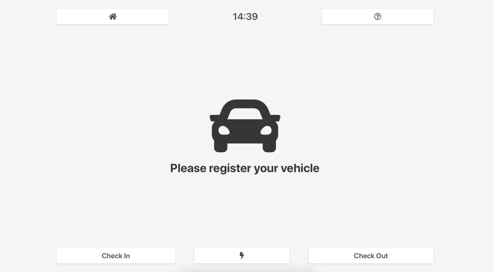
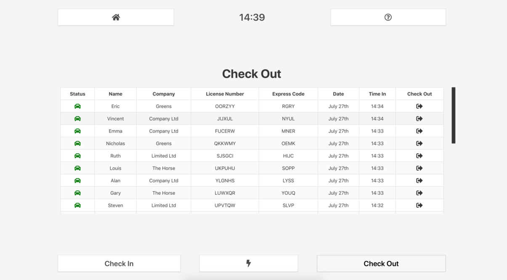
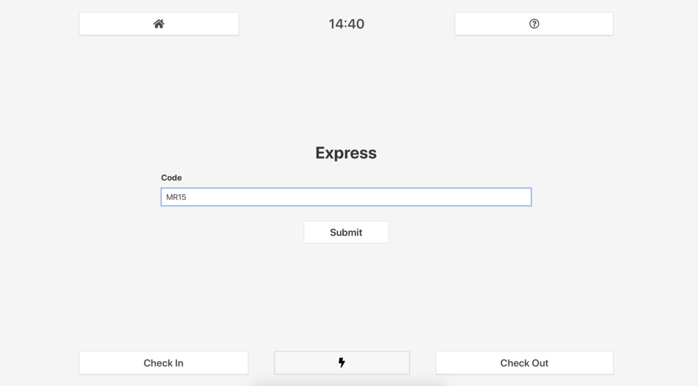

# Checkin Thing

Something I built when I felt inspired whilst half asleep.

Go to ./?app to enable all users to check out. If not the system will only allow you to check yourself out (uses a cookie).

Not finished and probably never will be.

